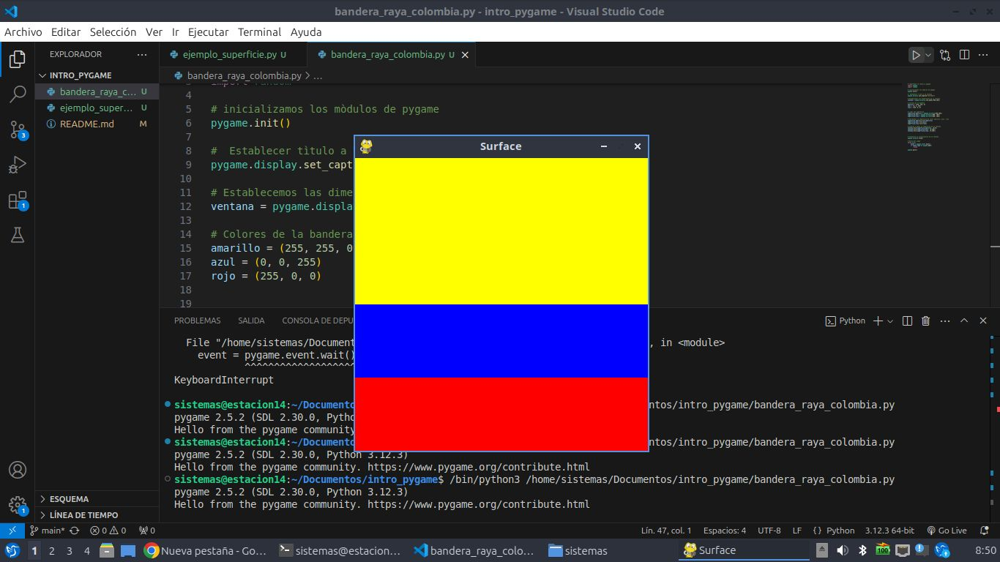

# Estructura de un juego en pygame

## Inicializaciòn

- Como todo programa en pytho se deben importar los modulos o librerias a utilizar
`import pygame`

- Inicializar pygame usuando la funcion init (). Inicializa todos los mòdulos de pygame importados.
`pygame.init()`

## Visualizaciòn de la ventana

`ventana = pygame.display.set_mode((600, 400))`

- set_mode() es la funcion encargada de definir el tamaño de la ventana. En el ejemplo, se esta definiendo una ventana de 600 px de ancho, por 400 px de alto.

`pygame.display.set_caption("Mi ventana")`

- set_caption() es la funcion que añade un titulo a la ventana.

### Funcion set_mode()
`set_mode(size =(0,0) flags = 0, depht = 0, display = 0)`
- size = (600,400) : define el tamaño de la ventana.

- flags : define uno omas comportamientos para la ventana.
    - valores :
        - pygame.FULLSCREEN
        - pygame.SESIZABLE
    - Ejemplo:
        - flags = pygame.FULLSCREEN | pygame,
        RESIZABLE: pantalla completa.
        dimensiones modificables.

## Bucle del juego - game loop
- Bucle infinito que se interrumpira al cumplir ciertos criterios.
- Reloj iterno del juego.
- En cada iteracion del bucle del juego podemos mover a un personaje, o tener en cuenta que un objeto a alcanzado a otro, o que se ha cruzado la linea de llegada lo que quiere decir ue la partida ha terminado.
- Cada iteracion es un oportunidad para actualizar todos los datos relacionados con el estado actual de la partida.
- En cada iteracion se realizan las siguientes tareas:
    1. Comprobar que no se alcanzan las condiciones de parada en cuyo caso se interrumpe el bucle.
    2. Actualizar los recursos necesarios para la iteracion actual.
    3. Obtener las entradas del sistema, o de interaccion con el jugador.
    4. Actualizar todas las entidades que caracterizan el juego.
    5. Refrescar la pantalla.

    ## Superficies pygame
    - SUperficie: 
       - Elemento geometrico.
       - Linea, poligono, imagen, texto que se muestra en la pantalla
       - El poligono se puede o no rellenar de color.
       - Las superficies se crean de diferente manera dependiendo del tipo: 
            - imagen: image.load()
            - texto: font.render()
            - Superficie generica: pygame.Superface()
            - Ventana del juego: pygame.display.set_mode()

# Ejemplo bandera de Colombia

```Python

# Establecer tìtulo a la ventana
pygame.display.set_caption("Surface")

# Establecemos las dimensiones de la ventana
ventana = pygame.display.set_mode((400,400))

# Colores de la bandera
amarillo = (255, 255, 0)
azul = (0, 0, 255)
rojo = (255, 0, 0)


# crear una superficie
superficie_amarillo = pygame.Surface((400,200))
superficie_azul = pygame.Surface((400, 100))
superficie_rojo = pygame.Surface((400, 100))

# Rellenamos la superficie de color amarillo, azul, rojo
superficie_amarillo.fill(amarillo)
superficie_azul.fill(azul)
superficie_rojo.fill(rojo)

# Inserto o muevo la superficie de la ventana 
ventana.blit(superficie_amarillo, (0,0))
ventana.blit(superficie_azul, (0,200))
ventana.blit(superficie_rojo, (0,300))


# Actualiza la visualizacion de la ventana 
pygame.display.flip()

# Bucle del juego
while True:
    event = pygame.event.wait()
    if event.type == pygame.QUIT:
        break

pygame.quit()

```
### Resultado



## Gestion del tiempo y los eventos.

### Modulo time

- Ofrece varias funciones que permite cronometrar la sesion actual desde el (init) o pausar, la ejecucion, por ejemplo.
- Funciones. 
    - pygame.time.get_ticks
    - pygame.time.waitpygame.time.delay

- Objeto clock
    - La funcion tick permite actualizar el reloj asociado con el juego actual.
    - Se llama cada vez que se actualiza la pantalla del juego.
    - Permite especificar el numero maximo de fotogramas que se muestran por segundo, y por tanto, limitar y controlar la velocidad de ejecucion del juego.
    - Si insertamos en un bucle de juego la siguiente linea, garantizamos que nunca se ira mas rapido de 50 fotogramas por segundo: `Clock.tick(50)`

### Gestion de eventos.

- Hay diferentes formas para que el programa sepa que se ha desencadenado un evento.
- Es esencial que los programas puedan conocer inmediatamente las acciones del jugador atraves del telado, el mouse, el joystick o cualquier otro periferico.

#### Funcion pygame.event.get
- Permite obtener todos los eventos en espera de ser procesados y que estan disponibles en una cola. 
- Si no hay ninhuno, se obtiene una coleccion vacia.

```python
# Usamos un bucle for para recorrer todos los eventos de la coleccion obtenida al llamar a la funcion get.
for event in pygame.event.get():
    if event.type == pygame.KEYDOWN:
        if event.key == pygame.K_SCAPE:
            PARAR_JUEGO = True
```

#### Funcion pygame.event.wait
- Esta funcion espera a que ocurra un evento, y en cuanto sucede esta disponible.

```python
while True:
    event = pygame.event.wait()
    if event.type == pygame.QUIT:
        break
```

#### Funcion pygame.event.poll
- Devuelve solo uno de los eventos que esta en la cola de espera.
